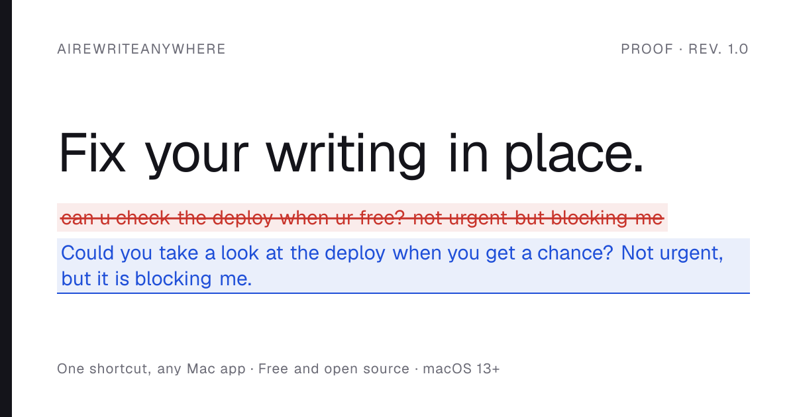
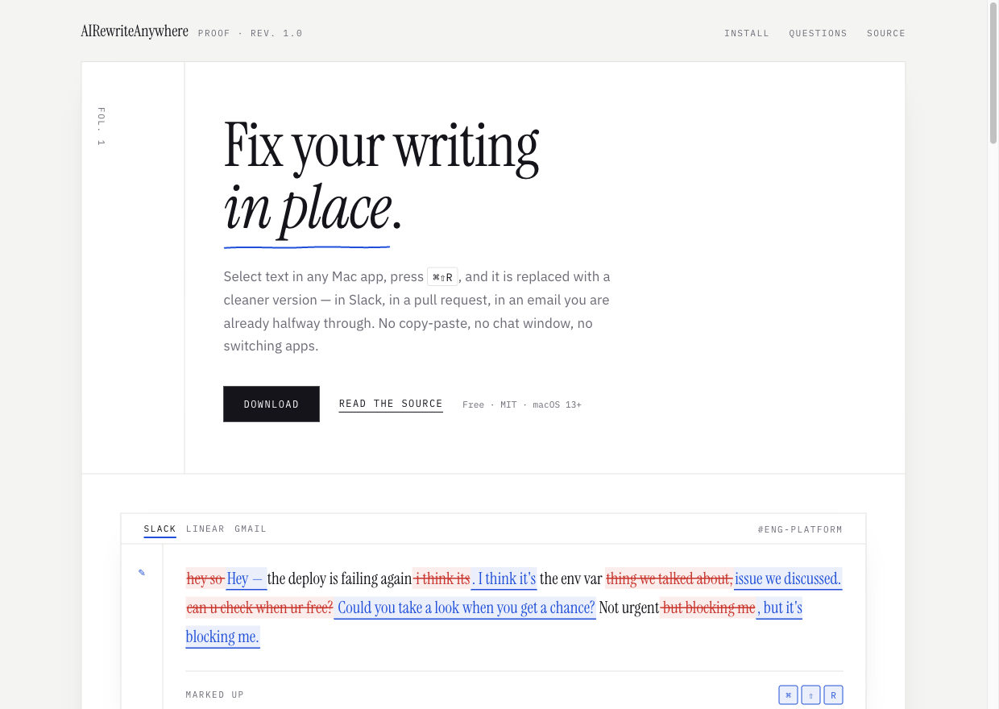
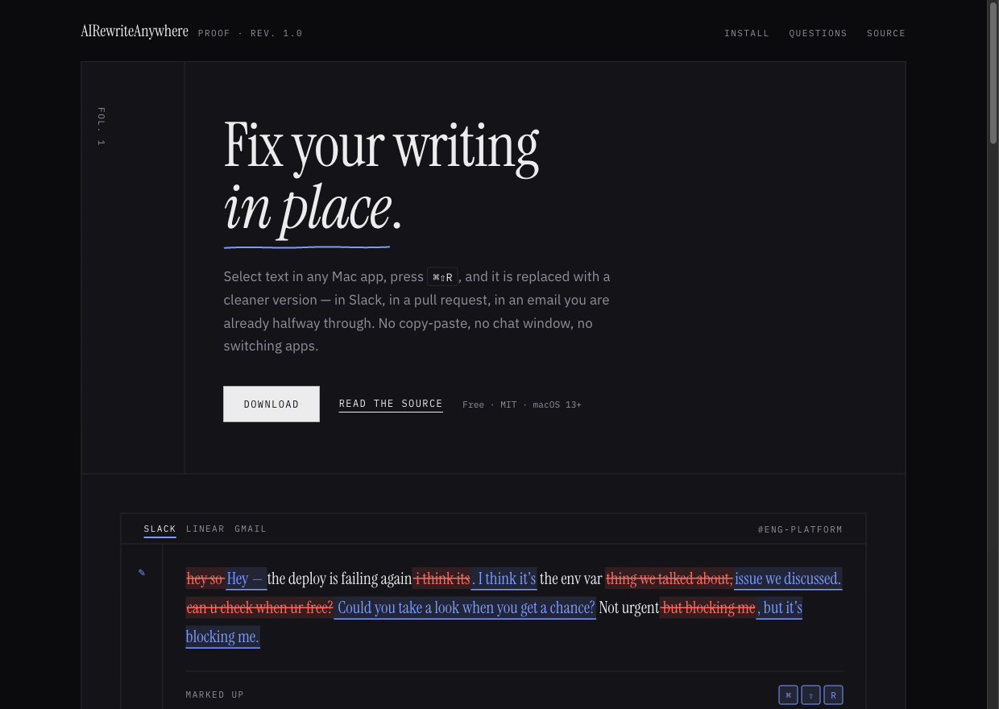

<div align="center">



<br>

[](https://github.com/Adityazero4/ai-rewrite-anywhere/releases/latest)
[](https://github.com/Adityazero4/ai-rewrite-anywhere/actions/workflows/ci.yml)
[](https://github.com/Adityazero4/ai-rewrite-anywhere/releases/latest)
[](LICENSE)

**[Download](https://github.com/Adityazero4/ai-rewrite-anywhere/releases/latest/download/AIRewriteAnywhere.zip)** ·
**[Website](https://ai-rewrite-anywhere.vercel.app)** ·
**[App docs](apps/macos/README.md)**

</div>

---

Select text in **any** Mac app, press `⌘⇧R`, and it is replaced with a cleaner version. No
copy-paste, no chat window, no switching apps.

It reads your selection through the macOS Accessibility API, so it is not built for any one app.
Slack, Chrome, Safari, Gmail, Notion, VS Code, Linear, Jira, Notes, Mail — if you can select the
text, you can rewrite it.

| Shortcut | Action | What it does |
|---|---|---|
| `⌘⇧R` | Rewrite | Fixes grammar and awkward phrasing, improves clarity and flow |
| `⌘⇧G` | Fix grammar | A proofread, not a rewrite — keeps your wording where it is already correct |
| `⌘⇧C` | Make concise | Cuts redundancy and filler, not substance |
| `⌘⇧P` | Make professional | Polished and credible, while staying conversational |

All four are configurable, and non-English text is translated into English — type
`kya kr rha hai bro`, press `⌘⇧R`, get English back.

## Install

Download the [latest release](https://github.com/Adityazero4/ai-rewrite-anywhere/releases/latest),
unzip, and move the app to `/Applications`. Then:

1. **Open it once by right-clicking → Open.** Builds are not notarized yet, so macOS will say it
   cannot check the app. You only do this the first time. ([Why?](#why-the-gatekeeper-warning))
2. **Grant Accessibility permission** when asked, then relaunch. This is how the app reads your
   selection and puts the rewritten text back — it is the only permission it needs.
3. **Add your OpenAI API key** in Settings from the menu-bar icon. It goes into the Keychain.

Or build it yourself — only the Xcode Command Line Tools are needed, not full Xcode:

```bash
git clone https://github.com/Adityazero4/ai-rewrite-anywhere.git
cd ai-rewrite-anywhere/apps/macos
make install     # builds, signs, and copies to /Applications
```

## Privacy

- Your text is sent to OpenAI **only** when you press a shortcut. Never in the background.
- It is **never logged and never written to disk**, and every request sets `store: false` so
  OpenAI does not retain it.
- Your API key lives in the **macOS Keychain**, not in a config file.
- Your clipboard is snapshotted and restored every time it has to be borrowed — images and
  formatting included.

## The website

<div align="center">


</div>

## Repository layout

```
apps/macos/   Swift package — the app itself, plus 178 tests
apps/web/     Next.js landing page
tools/        make-icon.swift — regenerates the icon, favicons and ASCII mark
docs/         images used by this README
```

Two independent projects in one repo. They share no build tooling, so there is no workspace
manager to install.

```bash
cd apps/macos && make test     # 178 checks
cd apps/macos && make run      # build, install, launch
cd apps/web   && npm install && npm run dev
```

## Releasing

Tag a version; GitHub Actions builds a universal binary, packages it, and publishes the release.

```bash
git tag v1.0.0 && git push origin v1.0.0
```

<a id="why-the-gatekeeper-warning"></a>

### Why the Gatekeeper warning

Notarizing a Mac app requires a Developer ID certificate, which requires a paid Apple Developer
account. Until then, releases are ad-hoc signed and macOS asks for confirmation on first launch.
The notarization step is already written into
[`release.yml`](.github/workflows/release.yml) and skips itself when the credentials are absent —
adding `APPLE_ID`, `APPLE_TEAM_ID`, `APPLE_APP_PASSWORD`, `APPLE_CERT_P12` and
`APPLE_CERT_PASSWORD` as repository secrets switches it on with no code change.

The app is open source precisely so you do not have to take an unsigned binary on trust — read it,
or build it yourself in one command.

## Known limitations

- Chromium and Electron apps rarely expose `AXSelectedText`, so those use a clipboard fallback
  that is roughly 100 ms slower. Your clipboard is always restored.
- macOS gives no acknowledgement that a synthetic paste was consumed, so the app can report that
  the keystroke was *sent*, not that it landed.
- `⌘⇧P` and `⌘⇧C` shadow VS Code's command palette and Chrome DevTools' inspect while the app
  runs. Rebind them in Settings if you need the originals.
- Password fields reject synthetic events by design.
- No streaming — the rewrite appears all at once.

<details>
<summary>The mark, in characters</summary>

Generated from the same drawing routine as the app icon by
[`tools/make-icon.swift`](tools/make-icon.swift), so it can never drift from it. It also prints
when you run `make app`, and in the browser console on the website.

```


                          @%
                         @@@#
                        #@@@@+
                       +@@@@@@:
                      -@@  @@@@.
                     :@@:. -@@@@.    .:-=**
             +*##****@@+++++*@@@@*+++==-:
                    @@#------@@@@#
                   @@#++++++++%@@@+
                  #@*          @@@@-
                 *@@            @@@@:
               .%@@#            @@@@@+:
              =+++++++        +++**##%%#
              :-:.....::--=+**#%%%##****#*
              -=++**+++==--:.
```

</details>

## License

MIT — see [LICENSE](LICENSE).
